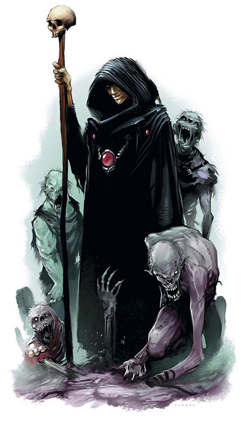

# first-repository
this is my beginning step to learning how to use git hub to make a repository 


1. [photo](#photo)
1. [important text](#important-text-x-non-orginised-text)
    1. [multi question](#multi-quistion-thingy)
1. [twitch channel](#twitch-channel)
1. [coding](#code)


# photo



## important text x non orginised text

> important text here

- item 1
- item 2

    - sub item 1
    - sub item 2
        - sub sub item 1
- item 3

1. number uno
1. numer duce
    1. numer o uno
    1. numer o duce

## multi quistion thingy

head 1 | head 2 | head3
:--- | :---: | ---:
numbers | letters | shapes

## twitch channel
[Here](https://www.twitch.tv/cheese_religion) is epic gamer pls follow

## code
```arduino
void setup() {
    serial.begin(9600)
    serial.println("hello")
}
```

## some actual text
**fat boy text** 

*funky text*

~~redactded text~~

**fat boy *funky text* thing**

**fat boy star \* thing**


<!-- here is some text i do not need to sue now but maby later -->

